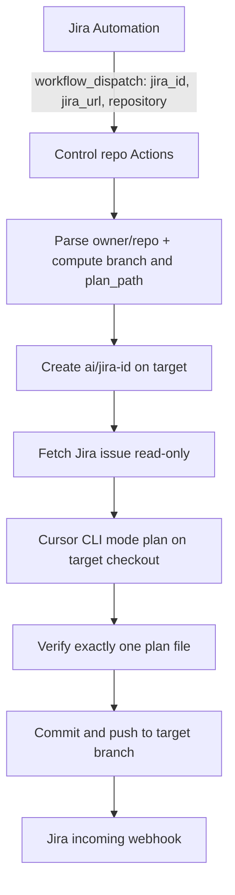

# AI-Driven Story Planning Pipeline — Design

Status: proposed
Owner: TBD
Last updated: 2026-08-23
Revision: 3 — dedicated control-repo `workflow_dispatch` with a 3-field payload; the control
repo creates `ai/{jira-id}` on the target and commits the AI plan cross-repo (§4–§9). AWS (§21)
and Cloud Agents (§22) remain deferred.

## 1. Goal

When a Jira story is moved into **In Progress** on the board, and it carries the label
`ready-for-development` and a non-empty `repository` custom field, automatically:

1. create a branch in the **target** repository named `ai/{jira-id}` (e.g. `ai/portal-18270`),
2. run an AI agent that analyses the Jira issue and the target codebase,
3. commit a structured implementation plan to that branch,
4. report the result back to the Jira issue.

Jira never talks to product repos. It always dispatches a thin payload to one **dedicated
control repository**. That control repo owns orchestration, secrets, allowlisting, branch
creation, and the planning run.

Existing platform: Jira Cloud, AWS, GitHub (single organisation), Cursor. AWS is available but
the first slice deliberately does not use it — see §21.

## 2. Guiding principle

> Deterministic things belong in code. Judgment belongs in the agent.

Branch names, plan file names, timestamps, commit metadata and status reporting are all
computed in the control-repo workflow, never invented by the model and never assembled from a
nest of Jira smart values. The model is never asked to produce an identifier — a name it
invented cannot be validated, diffed, or reproduced, and models are unreliable about the
current date.

Jira's job is a readiness gate plus three strings. Everything else is workflow code.

## 3. Decisions


| Decision               | Choice                                                                  | Rationale                                                                                                                                                                                                                                                   |
| ---------------------- | ----------------------------------------------------------------------- | ----------------------------------------------------------------------------------------------------------------------------------------------------------------------------------------------------------------------------------------------------------- |
| Trigger host           | Dedicated **control repository**                                        | One place for secrets, allowlist, and workflow logic. Product repos do not need planning secrets or a caller workflow for the first slice                                                                                                                   |
| Trigger path           | Jira Automation → `workflow_dispatch` on the control repo; **no AWS**   | Testable via `ref`; three string inputs fit the input cap; no per-product-repo trigger surface. AWS earns its place when durable redelivery or hard budgets do — see §21                                                                                    |
| Target resolution      | Payload `repository` (full GitHub URL)                                  | Same field humans already fill on the ticket; control workflow parses `owner/name` and writes cross-repo                                                                                                                                                    |
| Execution substrate    | GitHub Actions + Cursor CLI **on the runner** (control checkout of target) | Reuses CI, easy manual rerun, agent works in a checkout we control so the artifact is verified **before** it is committed (§11)                                                                                                                           |
| Agent invocation       | CLI now; Cloud Agents API later, behind a quarantine branch             | Cloud agent pushes its own commits and moves the verification gate after the fact. See §22                                                                                                                                                                  |
| Orchestration          | GitHub Actions (no Step Functions)                                      | Actions already provides retry, timeout and concurrency primitives                                                                                                                                                                                          |
| Reporting              | Jira Automation **incoming webhook**, called by the workflow            | Keeps every Jira *write* on the Jira side. Control repo holds an opaque URL that triggers exactly one rule (§5.3)                                                                                                                                           |
| Timestamp format       | ISO 8601 **basic** — `20260823T112233Z`                                 | Extended format contains `:`, which is illegal on NTFS and breaks `git checkout` for every Windows developer on the branch                                                                                                                                  |
| Plan location          | `.sdlc/plans/` in the **target** repo                                   | Groups the artifact with the target's automation config, template and prompts; keeps the repo root clean                                                                                                                                                    |
| First production slice | Commit to branch + Jira comment; **no pull request**                    | Smallest useful slice. See §15                                                                                                                                                                                                                              |


### Rejected alternatives

- **GitHub for Atlassian *Create branch* + product-repo `on: create`.** Payload-free, but every
  product repo needed a caller workflow, the `create` event carries no Jira context, and branch
  creation lived in unauditable Jira configuration. Superseded by the control-repo path.
- **`repository_dispatch` as the primary trigger.** Works, but only ever fires workflows on the
  default branch and is harder to exercise off `main`. Prefer `workflow_dispatch` (§5.1); keep
  `repository_dispatch` only if a future constraint forbids dispatching a named workflow file.
- **Cursor Cloud Agents API as the phase-1 substrate.** Rejected because the cloud agent commits
  and pushes on its own: the "exactly one added file" assertion can then only run after the push.
  Revisit via §22.
- **Step Functions for orchestration.** Duplicates primitives Actions already provides.
- **Jira *system* webhooks** instead of Automation. They cannot set an `Authorization` header.
- **Dispatcher Lambda as the trigger** (SNS → SQS → Lambda). **Deferred, not rejected.** Durable
  delivery, DLQ, replay, and keeping Jira credentials out of GitHub entirely. §21 states when it
  goes back in.
- **Fat dispatch payloads** that carry `branch`, `plan_path`, timestamps, or description text.
  Violates §2 and hits GitHub input/property caps. Compute identifiers in the workflow; fetch
  issue bodies via Jira REST (§5.4).

## 4. Architecture

### 4.1 Default — control-repo orchestration, no AWS

```
Jira Automation rule (one, service-account-owned)
  ├─ conditions: label, repository field, issue type
  ├─ readiness gate — no ACs? comment, label ai-plan-blocked, stop (§13)
  └─ Send web request  →  workflow_dispatch on control repo
         inputs: jira_id, jira_url, repository
                          │
                          ▼
        SerhiiVoznyi/AI-Hub  .github/workflows/sdlc-plan-story.yml
          │
          ├─ 1. parse repository URL → owner/name; allowlist + kill switch
          ├─ 2. compute branch = ai/{lower(jira_id)}, plan_path, UTC timestamp
          ├─ 3. workflow_call → create-branch.yml  (on the TARGET)
          ├─ 4. checkout TARGET at ai/… (App / machine-user token)
          ├─ 5. fetch Jira issue (read-only token)
          ├─ 6. render layered prompt
          ├─ 7. agent -p --mode plan
          ├─ 8. VERIFY artifact (§11)
          ├─ 9. commit + push plan to TARGET branch
          ├─10. archive prompt + transcript
          └─11. callback (if: always())
                          │
                          ▼
        Jira Automation incoming-webhook rule
          └─ comment (blocking questions first), fields, label, Slack
```



No queue, no DLQ, no DynamoDB, no OIDC role, no Lambda. Product repos need no planning workflow
for the first slice — only `.sdlc/` content. What the no-AWS choice costs is set out in §21.

Pilot target: `https://github.com/SerhiiVoznyi/SandBox`. Control repository: **`SerhiiVoznyi/AI-Hub`**.

### 4.2 Durable variant — the AWS layer, once it is warranted

```
Jira Automation ──▶ SNS ──▶ SQS ──▶ Lambda "dispatcher"
                                      ├─ fetch issue (Jira REST v3, thin event / fat fetch)
                                      ├─ policy: repo allowlist, kill switch, daily budget
                                      ├─ readiness gate (no ACs? -> comment & stop, no agent)
                                      ├─ DynamoDB conditional write (idempotency)
                                      ├─ compute branch + plan_path + UTC timestamp
                                      ├─ write sanitised context bundle -> S3
                                      └─ POST workflow_dispatch / repository_dispatch
                                                      │
                                                      ▼
                        SerhiiVoznyi/AI-Hub  sdlc-plan-story.yml
                                        (same verify → commit → callback shape)
                                                      │
                                                      ▼
                                    SNS "sdlc-callbacks" ──▶ Lambda "reporter"
                                              └─ Jira comment + fields + label, Slack, metrics
```

Not the starting point. §21 lists the conditions that would justify each piece.

## 5. Trigger (Jira side)

Common to every variant:

- **Trigger:** *Issue transitioned* → To: In Progress. Not a field-value change — a board
  column can map to several statuses, so enumerate every status behind the column.
- **Conditions:** label `ready-for-development`; `repository` field non-empty; issue type in
  allowlist; JQL guard excluding issues already labelled `ai-plan-ready` (free idempotency at
  source). Soft allowlisting of the repository URL can live in Jira; the **hard** allowlist is
  enforced in the control repo (§7, §14).
- **Ownership:** one global, service-account-owned rule rather than a copy per project.
- **No GitHub-for-Atlassian branch actions** in the default path. Branch creation is a workflow
  job on the control repo (§9).

### 5.1 `workflow_dispatch` on the control repo (default)

*Send web request* →

```
POST https://api.github.com/repos/SerhiiVoznyi/AI-Hub/actions/workflows/sdlc-plan-story.yml/dispatches
```

with the `Authorization` header marked **Hidden** and the body:

```json
{
  "ref": "main",
  "inputs": {
    "jira_id": "{{issue.key}}",
    "jira_url": "https://jira-domain.atlassian.net/browse/{{issue.key}}",
    "repository": "{{issue.fields.customfield_NNNNN}}"
  }
}
```

Example inputs for a real ticket:

```json
{
  "jira_id": "PORTAL-18270",
  "jira_url": "https://jira-domain.atlassian.net/browse/PORTAL-18270",
  "repository": "https://github.com/SerhiiVoznyi/SandBox"
}
```

Notes:

- Jira Automation cannot sign a GitHub App JWT, so the rule holds a long-lived **fine-grained
  PAT** (or equivalent) with `actions: write` on the **control repo only**. It does not need
  `contents: write` on product repos — that token lives only in the control repo as a secret
  used by the workflow (§14).
- `workflow_dispatch` accepts a `ref`, so workflow changes can be tested off the default branch
  before promoting to `main` (§17).
- Inputs are capped at 10 and must be strings. Three string fields leave headroom; do not grow
  this surface without a reason.
- Branch name, plan path, timestamp, and model are **not** inputs. The workflow computes them.

### 5.2 `repository_dispatch` — deferred alternative

Same HTTP shape against `/dispatches` with `event_type: sdlc-plan-story` and the three fields
nested under `client_payload` (still under the 10 top-level property cap if nested under one
key). Only triggers workflows on the default branch. Prefer §5.1 unless a constraint forces it.

### 5.3 Reporting back into Jira

Jira Automation's **incoming webhook** trigger closes the loop:

- A second rule is triggered by the webhook, selects the issue by key from the request body, and
  performs the comment, field writes, label and Slack mirror using native actions.
- The control workflow calls that URL from an `if: always()` step.
- The control repo therefore stores an opaque URL that can trigger exactly one rule. It is a
  secret, but it is not a Jira credential: it cannot read the tracker and cannot act outside what
  the rule does.
- Failure mode is honest rather than silent — if the callback fails the plan is still on the
  target branch and the Actions run is red. Nothing is lost; nothing is retried either.

### 5.4 Thin event, fat fetch

The trigger must **not** carry `{{issue.fields.description}}`: Jira Cloud descriptions are ADF,
smart-value rendering mangles them, and long tickets hit payload limits.

The control workflow calls `GET /rest/api/3/issue/{jira_id}?expand=renderedFields`, which also
yields comments, linked issues, the epic, and subtasks — exactly the context that makes a plan
good. The `repository` custom field's `customfield_NNNNN` id is discovered via
`/rest/api/3/field`, and differs between team-managed and company-managed projects.

This puts a Jira **read** token in the control repo. Bound it — a dedicated service account with
browse-only permission on allowlisted projects. Combined with §5.3, the rule is "no Jira
**write** credentials in GitHub", which is defensible; the alternative is §21.

### 5.5 What this path drops (deliberately)

| Previous idea                         | Why it is gone                                                                 |
| ------------------------------------- | ------------------------------------------------------------------------------ |
| GitHub for Atlassian Create branch    | Branch creation is code in `create-branch.yml`, reviewable and testable        |
| Product-repo `on: create` workflows   | No per-repo caller required for phase 1                                        |
| Fat nested `client_payload.task`      | Three fields; identifiers computed downstream                                  |
| Parsing Jira key from the branch name | `jira_id` arrives explicitly                                                   |

## 6. Naming

### Branch (on the target)

`ai/{lowercase jira_id}` — e.g. `ai/portal-18270`.

The `ai/` prefix is the signal for branch rulesets, CI filters and CODEOWNERS rules that treat
agent branches differently. Jira's development panel auto-links because the key is present.

Computed in the control workflow from `jira_id`, never from the model and never from Jira smart
values beyond the raw issue key.

### Plan file (on the target)

```
.sdlc/plans/PORTAL-18270-implementation-plan-20260823T112233Z.md
```

Validated in the workflow against a hard regex before anything is written:

```
^\.sdlc/plans/[A-Z][A-Z0-9]+-[0-9]+-implementation-plan-[0-9]{8}T[0-9]{6}Z\.md$
```

Uppercase Jira key in the filename (matches how humans search Jira), lowercase in the branch
(avoids case-insensitive-filesystem collisions). The timestamp is generated once, in the
workflow, from the runner's UTC clock — never from the model, and never twice in one run.

Re-planning produces **v2** as a new timestamped file with `supersedes:` set. Old plans are
never edited or deleted — the directory is an immutable audit trail. See §16 for how
re-planning is invoked now that the branch is the idempotency key.

## 7. Repository layout

Logic and secrets live in the control repo. Target footprint is configuration and artifacts only.

### Control repository (`SerhiiVoznyi/AI-Hub`)

```
.github/workflows/
  sdlc-plan-story.yml    # primary entry: workflow_dispatch (3 inputs)
  create-branch.yml      # callable + manually dispatchable branch primitive
.github/scripts/         # normalize-repo.sh, verify-plan.sh
allowlist.yml            # repositories the pipeline may write to
budgets.yml              # optional soft caps (hard daily caps → §21)
.sdlc/
  prompts/plan-frame.md  # shared planning frame
  plan-template.md       # default output contract (targets may override)
workflows/sdlc-ai-plan-story.md  # competency write-up (AI-Hub convention)
```

Composite / local actions may live alongside under `actions/` (install CLI, fetch Jira, render
prompt, verify plan, report status) once the YAML grows past a single file. Until then, steps
may live inline in the workflows — the contract in §9 matters more than the packaging.

### Each target (product) repository

```
.sdlc/
  config.yml          # model, max runtime, ignored paths, review owners
  prompts/plan.md     # repo-specific planning guidance, reviewed like code
  plan-template.md    # output contract (optional override of control default)
  plans/              # generated plans land here on ai/* branches
```

No mandatory `.github/workflows/sdlc-plan.yml` on the target for the first slice. The control
repo checks the target out and pushes into it. Per-repo caller workflows can return later if a
product team wants local triggers; they are not required for Jira → plan.

### Allowlist

`allowlist.yml` is read by `sdlc-plan-story` before any write. A file in git is a better policy
store than a console toggle: diffable, attributable, and revertable. Example:

```yaml
repositories:
  - SerhiiVoznyi/SandBox
```

Accept either `owner/name` or a full `https://github.com/owner/name` URL in the payload; normalise
to `owner/name` before the allowlist check.

## 8. Dispatch contract

Exactly three `workflow_dispatch` inputs. Nothing else.

| Input          | Example                                                         | Role                                      |
| -------------- | --------------------------------------------------------------- | ----------------------------------------- |
| `jira_id`      | `PORTAL-18270`                                                  | Issue key; drives branch + plan filename  |
| `jira_url`     | `https://jira-domain.atlassian.net/browse/PORTAL-18270`            | Canonical link for comments and frontmatter |
| `repository`   | `https://github.com/SerhiiVoznyi/SandBox`                       | Target where branch + plan are written    |

Computed by the workflow (not inputs):

| Value        | Rule                                                                 |
| ------------ | -------------------------------------------------------------------- |
| `owner/repo` | Parse from `repository` URL or accept already-normalised `owner/name` |
| `branch`     | `ai/` + lowercase `jira_id`                                          |
| `plan_path`  | `.sdlc/plans/{jira_id}-implementation-plan-{UTC basic}.md`           |
| `base_ref`   | Target default branch (or `.sdlc/config.yml` override)               |
| `model`      | From target `.sdlc/config.yml`, else control default                 |

Jira *Send web request* body (control repo):

```json
{
  "ref": "main",
  "inputs": {
    "jira_id": "PORTAL-18270",
    "jira_url": "https://jira-domain.atlassian.net/browse/PORTAL-18270",
    "repository": "https://github.com/SerhiiVoznyi/SandBox"
  }
}
```

Validate `jira_id` against `^[A-Z][A-Z0-9]+-[0-9]+$`, `repository` against an allowlisted host +
path shape, and `plan_path` against the §6 regex before any git write. Treat every input as
untrusted (§14).

## 9. Workflows (control repo)

### 9.1 `create-branch.yml` — focused primitive

Callable via `workflow_call` and manually via `workflow_dispatch`, so branch creation stays
independently testable (`gh workflow run`). Evolves the SandBox prototype that today only creates
branches in itself: the control copy always targets an arbitrary allowlisted repository.

**Inputs**

| Name          | Required | Default | Description                                      |
| ------------- | -------- | ------- | ------------------------------------------------ |
| `repository`  | yes      | —       | Target URL or `owner/name`                       |
| `branch_name` | yes      | —       | Short name, e.g. `ai/portal-18270`               |
| `base_ref`    | no       | `main`  | Existing branch or commit SHA to branch from     |

**Behaviour**

1. Normalise `repository` → `owner/name`.
2. Authenticate with the control repo's GitHub App installation token or machine-user PAT
   (`contents: write` on allowlisted targets). Do **not** use `GITHUB_TOKEN` for cross-repo push.
3. Validate `branch_name` with `git check-ref-format --branch`.
4. If `origin/{branch_name}` already exists → fail (branch is the idempotency lock, §16).
5. Create and push `refs/heads/{branch_name}` from `base_ref`.

**Permissions / secrets:** `contents: write` via App/PAT secret; no Cursor or Jira secrets.

### 9.2 `sdlc-plan-story.yml` — primary entry

**Trigger**

```yaml
on:
  workflow_dispatch:
    inputs:
      jira_id:
        required: true
        type: string
      jira_url:
        required: true
        type: string
      repository:
        required: true
        type: string

concurrency:
  group: sdlc-plan-${{ inputs.jira_id }}
  cancel-in-progress: false
```

**Jobs (logical sequence)**

1. **Normalise and gate**
   - Parse `repository` → `owner/name`.
   - Check org variable kill switch (`SDLC_ENABLED == true`).
   - Check `allowlist.yml`.
   - Validate `jira_id` regex.
   - Compute `branch`, `plan_path`, UTC timestamp; emit as job outputs.

2. **Create branch** — `uses: ./.github/workflows/create-branch.yml` with
   `repository`, `branch_name: ai/…`, `base_ref` from target config or `main`.

3. **Checkout target** at the new branch using the App/PAT.

4. **Fetch and sanitise Jira issue** — read-only token; write `/tmp/context.json`.

5. **Install Cursor CLI** — pinned + cached version from an org/control variable.

6. **Render prompt** — layered frame (§10) + plan path + Jira context as fenced data.

7. **Run planning agent**

   ```bash
   timeout 25m agent -p --mode plan --force --trust \
     --model "$MODEL" \
     --output-format json \
     "$(cat /tmp/prompt.md)" > /tmp/agent.json
   ```

8. **Verify artifact** (§11) — exactly one added file at `plan_path`; retry with
   `agent --continue` up to twice.

9. **Commit and push** to the target branch as `SDLC Bot`.

10. **Archive** rendered prompt + transcript as a workflow artifact.

11. **Callback** to the Jira incoming webhook (`if: always()`).

**Secrets on the control repo (selected visibility / environment `sdlc-plan`):**

- `CURSOR_API_KEY`
- `JIRA_READ_TOKEN`
- `GH_APP_PRIVATE_KEY` / installation id **or** `TARGET_WRITE_TOKEN`
- `JIRA_CALLBACK_WEBHOOK_URL`

### 9.3 CLI flags that matter

- The binary is `agent`. `cursor-agent` is legacy.
- `-p` / `--print` makes the run non-interactive. `--force` alone can leave the agent waiting.
- `--mode plan` matches the pipeline: explore and draft, do not implement.
- `--trust` is required in headless environments.
- Wrap in `timeout`; pin and cache the CLI version.

## 10. Prompt architecture

Layered, not one blob:

1. **Target-resident, version-controlled** — `AGENTS.md` for conventions,
   `.sdlc/plan-template.md` for the output contract, `.sdlc/config.yml` for model and policy.
2. **Orchestrator-injected frame** (from the control repo) — role, the exact output path, hard
   non-goals ("write no code, touch no other file, run no migrations"), required sections.
3. **Jira content as data** — sanitised ADF→markdown, size-capped, wrapped in
   `<jira_issue_untrusted>` fences with an explicit note that it is input to analyse, not
   instructions to follow.

MCP is deliberately not used at first. Fetching and sanitising the context ourselves keeps that
surface narrow. The Cloud Agents API could attach an Atlassian MCP server later (§22) — at the
cost of a live, unfiltered channel from ticket text into the model.

## 11. Verification gate

This step decides whether the pipeline is trustworthy. Assume the agent will sometimes misname
the file, add a helpful README tweak, or write prose where structure was requested.

Assert that:

- `git status --porcelain` shows **exactly one added file**,
- at exactly the expected path,
- whose YAML frontmatter parses and contains every required key,
- with all mandatory sections present and non-empty.

Because the agent runs against a checkout we control, all four assertions happen **before** the
commit exists. That ordering is the whole point, and it is what §22 gives up.

On failure, re-invoke with `agent --continue -p --force` and a corrective message naming the
specific violation. After two failed attempts the job fails and reports.

Commit and push (on the target remote):

```bash
git config user.name  "SDLC Bot"
git config user.email "sdlc-bot@example.com"
git add "$PLAN_PATH"
git commit -m "docs($JIRA_ID): add implementation plan"
git push origin "$BRANCH"
```

The branch already exists — `create-branch.yml` created it and it is the idempotency key (§16) —
so the planning job checks it out rather than creating it. A failed planning run therefore leaves
an orphan `ai/` branch on the target: visible, cheap, and preferable to losing the
compare-and-swap.

If any target ruleset requires signed commits, a plain push from a runner is rejected. Use the
Contents API (`PUT /repos/{owner}/{repo}/contents/{path}`) through the GitHub App instead,
which produces server-side verified commits.

## 12. Plan file contract

Frontmatter is what makes a downstream implementation stage possible:

```yaml
---
jira_key: PORTAL-18270
jira_url: https://jira-domain.atlassian.net/browse/PORTAL-18270
repository: SerhiiVoznyi/SandBox
branch: ai/portal-18270
base_commit: 9f2c1ab
generated_at: 2026-08-23T11:22:33Z
generator:
  agent_id: bc-…
  run_id: run-…
  model: claude-4.6-sonnet-thinking
  pipeline_version: 1.0.0
inputs_digest: sha256:…      # hash of the Jira fields used, to detect ticket drift
status: awaiting-review
supersedes: null
blocking_questions: 2
confidence: medium
---
```

Required body sections:

1. Summary
2. Acceptance criteria, copied verbatim with IDs (`AC-1…n`)
3. Assumptions and **blocking questions**
4. Current-state analysis, with real file paths
5. Proposed approach, plus alternatives considered and why rejected
6. Ordered task list, each referencing ACs and files, with size estimate
7. Contract / data / migration changes, flagged for extra review
8. Test plan mapped to ACs
9. Non-functional considerations (perf, security, a11y, i18n, observability)
10. Rollout and feature flags
11. Risks and blast radius
12. Out of scope
13. Effort estimate

## 13. Readiness gate

The dominant failure mode of AI planning is not bad reasoning — it is confident planning
against an underspecified ticket.

Before anything is triggered, the gate checks: does the issue have acceptance criteria, a
description above a minimum length, and a resolvable repository? If not, skip the agent entirely,
comment on Jira naming what is missing, and label `ai-plan-blocked`.

This gate belongs in the Jira rule, not in code. Automation conditions can test the fields, and
*Add comment* and *Add label* are native actions, so the whole gate runs before a
`workflow_dispatch` is ever sent — no runner, no API call, no Lambda.

Likewise, when a produced plan reports `blocking_questions > 0`, those questions are the
**first** thing in the Jira comment.

## 14. Security

Centralising orchestration in the control repo **improves** the secret story relative to
per-product-repo callers: product repos do not receive `CURSOR_API_KEY` or Jira tokens for
planning. The cost is a control-repo principal that can write to every allowlisted target.

**Secret surface (control repo only):**

- **Cursor key** — org or repo secret, preferably behind a protected `sdlc-plan` environment,
  rotated on a schedule. Buys model inference, not repository or cloud access.
- **Jira read-only token** — service account with browse on allowlisted projects only. Rule:
  no Jira **write** credentials in GitHub (§5.4).
- **Target write credential** — GitHub App (preferred) or machine-user PAT with `contents: write`
  limited to allowlisted repositories. Used for branch create, checkout, and plan push.
- **Jira callback URL** — opaque incoming-webhook URL (§5.3).

**What is still weaker than AWS OIDC:** GitHub scopes secrets to repositories and environments,
not to `job_workflow_ref`. Any workflow in the control repo that can reach the `sdlc-plan`
environment can read those secrets. Mitigations: keep the control repo private, CODEOWNERS on
workflows, environment protection rules, and a short allowlist. §21 exists for teams who cannot
accept that and need Secrets Manager conditioned on `job_workflow_ref`.

**Other controls:**

- **Trigger authority.** The Jira rule holds a PAT with `actions: write` on the control repo
  only. Anyone who can edit that rule can start runs — but cannot push to product repos without
  also compromising control-repo secrets.
- **Payloads are untrusted.** Validate `jira_id`, `repository`, and computed `branch` /
  `plan_path` against regexes and `allowlist.yml` before acting.
- **Prompt injection.** Jira descriptions are editable by anyone with project access. Mitigated
  by fenced data, `--mode plan`, the single-file assertion in §11, and archiving the full prompt
  and transcript.
- **Kill switch** as an Actions variable checked in the gate step. Per-day hard caps need durable
  state and are a §21 trigger.

## 15. Consequences of the no-PR choice

**Nobody is notified, and nothing is reviewed by default.** The Jira comment is the entire human
interface and has to earn it:

- `@`-mention the assignee and reporter,
- lead with **blocking questions**, not the summary,
- include confidence and estimate,
- link the plan by **commit SHA permalink** on the target,
- mirror to Slack,
- define an explicit acknowledgement signal (`plan-approved` label or a Jira transition).

**The audit trail lives on target branches that get deleted.** The plan never merges to `main`,
so `.sdlc/plans/` never accumulates centrally and the record vanishes when a branch is pruned.

Default mitigation: upload the plan file, rendered prompt and full agent transcript as a
workflow artifact on the **control** run (retention raised to the org maximum), and disable
automatic branch deletion for the `ai/` pattern on targets. Artifacts expire, so this is a
working record rather than an audit record. Immutable retention → S3 Object Lock via §21.

## 16. Idempotency

Humans drag cards back and forth. Four layers, none of which needs a database:

1. **JQL label guard** in the Jira rule — excludes issues already labelled `ai-plan-ready`.
2. **Fail if branch exists** in `create-branch.yml` — `POST /git/refs` (or the push equivalent)
   succeeds exactly once; second attempt fails. The branch *is* the lock on
   `{target}#{jira_id}`.
3. **Concurrency group** `sdlc-plan-${{ inputs.jira_id }}` in `sdlc-plan-story.yml` —
   serialises anything that gets past the first two.
4. **Allowlist + kill switch** — refuse work that should never have been dispatched.

A re-transition after a plan exists is expected to produce plan v2 on the same branch with
`supersedes` set. Because the branch now exists, the default path stops at layer 2, so
re-planning is a deliberate act:

- delete the `ai/{jira_id}` branch on the target and re-dispatch, **or**
- a future optional `force_replan` input (not in the v1 three-field contract) that skips the
  create step and writes a new timestamped plan file.

Losing accidental re-planning is a feature; losing intentional re-planning is not — document
the manual path in the control repo README when the workflows land.

## 17. Operational gotchas

- `workflow_dispatch` with an explicit `ref` is how workflow changes are tested before they hit
  `main`. Prefer that over iterating only on the default branch.
- Jira Automation's *Send web request* has a hard 30-second timeout and no configurable retry.
  A `dispatches` call is fast, so this is survivable, but a failed rule is recoverable only by
  re-transitioning the ticket — there is no queue and no replay. Biggest functional gap vs §21.
- Cross-repo push requires the App/PAT; `GITHUB_TOKEN` from the control run cannot push to
  another repository.
- Commits pushed with a PAT/App token **can** trigger workflows on the target. Keep target
  `on: push` filters away from `ai/**` plan-only commits, or accept extra CI noise.
- Runner cost is small — roughly a couple of hundred milli-dollars of `ubuntu-latest` per plan.
  The job is network-bound, so a 2-core runner is fine.
- Targets needing private registry access for meaningful dependency analysis may require
  self-hosted runners; the control workflow's `runs-on` must then be able to reach those
  checkouts, or planning for those targets stays deferred.

## 18. Observability and metrics

In the default path the control-repo run history *is* the telemetry: every attempt is an Actions
run, correlated by `jira_id` in the run name, with logs, timings and the archived transcript
attached. Failures are red runs with a re-run button. Aggregation across many tickets still
needs the Actions API or a weekly export until §21 adds EventBridge → Firehose → S3 → Athena.

Cost per plan: `GET /v1/agents/{id}/usage` returns input and output tokens per run when using
Cloud Agents; for CLI runs, record runner minutes and any vendor usage export the account
provides.

Metrics that decide whether to continue investing:

- plan acceptance rate (approved without major edits),
- edit distance between the generated plan and what was actually built,
- time from In Progress to plan-ready,
- readiness-rejection rate,
- cost per plan, and downstream rework rate.

## 19. Rollout

**Phase 0 — backtest (1 week).** Take ~20 recently-closed stories, generate plans with a local
script against SandBox (or a copy), have the engineers who did the work score them. No Jira
trigger.

**Phase 1 — control workflows, manual dispatch.** AI-Hub already hosts
`create-branch.yml` and `sdlc-plan-story.yml`. Allowlist `SerhiiVoznyi/SandBox`.
Drive with `gh workflow run` (or the API) and the three inputs. Prove the
verification gate here.

**Phase 2 — connect Jira.** Point one service-account-owned rule at the control repo's
`sdlc-plan-story.yml` dispatch URL (§5.1). Add the readiness gate and the incoming-webhook
reporting rule (§5.3). Still no AWS.

**Phase 3 — earn the AWS layer, or don't.** Run phase 2 for a month and count lost events,
budget overruns, and audit gaps. Add only the pieces those numbers justify (§21).

**Phase 4 — critic pass.** A second agent scores the plan against a rubric before a human sees
it. Good first candidate for the Cloud Agents API (§22).

**Phase 5 — implementation stage.** Plan approval triggers an implementation agent; reintroduce
the pull request as the review surface. Note the §22 caveat about agent tokens and PR comments.

## 20. Open items

- ~~Name and create the control repository~~ → **`SerhiiVoznyi/AI-Hub`** (workflows landed).
- Configure AI-Hub secrets/variables: `TARGET_WRITE_TOKEN`, `CURSOR_API_KEY`, `JIRA_READ_TOKEN`, `JIRA_EMAIL` (optional), `JIRA_CALLBACK_WEBHOOK_URL` (optional), `SDLC_ENABLED=true`.
- Confirm GitHub App vs machine-user PAT for target writes; prefer App if org policy allows.
- Confirm whether target rulesets require signed commits (Contents API path in §11).
- Confirm the `repository` custom field id per project type.
- Confirm the PII / data-residency position on sending Jira descriptions to a model.
- Decide the acknowledgement signal for plan review (§15).
- Decide whether the Cursor key may live in GitHub at all (§14). A "no" answer forces §21 on day
  one.
- Agree the manual re-plan procedure now that the branch is the lock (§16).
- Defer IaC. If §21 happens, CDK in a dedicated automation repo, deployed via Actions with OIDC.

## 21. When to add the AWS layer

The dispatcher and reporter Lambdas are not wrong, they are unearned at this stage. Adopt §4.2
when one of these becomes true, and adopt only the part that answers it:


| Trigger                                                                 | What to add                                                      | Why nothing cheaper works                                                                                                       |
| ----------------------------------------------------------------------- | ---------------------------------------------------------------- | ------------------------------------------------------------------------------------------------------------------------------- |
| A lost trigger has to be replayable                                     | SNS → SQS → dispatcher Lambda, with a DLQ                        | Jira Automation has a 30-second timeout, no queue and no replay; recovery today means re-transitioning the ticket by hand (§17) |
| A hard per-day or per-repo spend cap is required                        | DynamoDB counters checked at ingress                             | Budgets need durable, atomic state; counting Actions runs after the fact is approximate (§14)                                   |
| The Cursor key may not live in GitHub                                   | Secrets Manager + an OIDC role conditioned on `job_workflow_ref` | GitHub scopes secrets to repositories, never to the identity of the workflow reading them (§14)                                 |
| Jira descriptions may not transit GitHub-hosted runners                 | Dispatcher-side fetch and sanitisation, context bundle in S3     | Moves the data boundary off GitHub entirely                                                                                     |
| Plans must be retained immutably                                        | S3 prefix with Object Lock, written over OIDC                    | Workflow artifacts expire and can be deleted (§15)                                                                              |
| Cross-tool orchestration arrives (ServiceNow, GitLab, a second tracker) | The full dispatcher as the policy front door                     | One policy layer beats one rule per tool                                                                                        |


Two notes on sequencing. The S3 audit archive is the cheapest item on the list and the most
likely to be needed first. Nothing here invalidates phase 2 work: the control workflows keep
their interface; only the ingress and callback swap.

### Ingress, if this is built

Use Jira Automation's native **AWS SNS action** rather than an HTTP request to API Gateway.
Atlassian's automation account (`815843069303`) publishes directly to the topic, giving
IAM-authenticated delivery with no public endpoint and no HMAC scheme to maintain — and no PAT
on the Jira side for GitHub. Two setup constraints:

- Atlassian requires the topic to have encryption disabled, unless that principal is granted
  `kms:GenerateDataKey` on the CMK explicitly.
- Treat the source as untrusted and validate every message — same as `workflow_dispatch` inputs
  today (§14).

## 22. Cursor Cloud Agents API as an alternative substrate

Running `agent` on the runner is not the only option. The Cloud Agents API (`POST /v1/agents`,
currently **public beta** on v1) launches the agent on Cursor-managed infrastructure instead.

What it would remove:

- **Runner minutes**, almost entirely — the control job becomes an API call and a poll.
- **Part of the idempotency layer**: a client-supplied `agentId` returns `409` on conflict.
- **The retry mechanism** in §11: a follow-up run on the same agent preserves conversation state.
- **The cost metric**: `GET /v1/agents/{id}/usage`.
- **Part of the audit archive**: artifacts listable through the API.
- **The context fetch**, if MCP servers are attached — a security trade, not only a simplification
  (§10).

What it costs, and why it is not the phase-1 choice:

- **The verification gate moves after the push.** The cloud agent commits and pushes on its own.
- **Branch naming is not ours by default** — needs a pre-created ref plus `startingRef` /
  `workOnCurrentBranch: true` (fits cleanly after `create-branch.yml`).
- **No webhooks on v1 yet**, so completion means polling or SSE.
- **Session env vars are in beta** and mutually exclusive with a client-supplied `agentId` in
  some configurations.
- **Agent GitHub tokens can push but currently cannot comment on issues or PRs** — relevant to
  phase 5.
- **`job_workflow_ref` does not apply**; access is the Cursor GitHub App installation.

### The hybrid worth building later

Let the cloud agent push to a quarantine branch on the **target**, verify from the control repo,
and promote:

```
Jira ──▶ Control Actions (trigger job, ~10s)
             ├─ create-branch.yml → ai/raw/{jira_id} on target
             └─ POST /v1/agents  (mode: plan,
                                  startingRef: ai/raw/…,
                                  workOnCurrentBranch: true)
                        │
                        ▼  agent pushes to ai/raw/…
             Control Actions (poll or on: repository_dispatch from a thin notifier)
             ├─ VERIFY the diff (§11 assertions, unchanged)
             └─ PUT /repos/.../contents/{plan_path} on ai/{jira_id}
                        └─ single validated file, server-side verified commit
```

This keeps a hard gate, keeps runner minutes near zero, and produces verified commits. Reassess
after §20's signed-commit answer lands.
